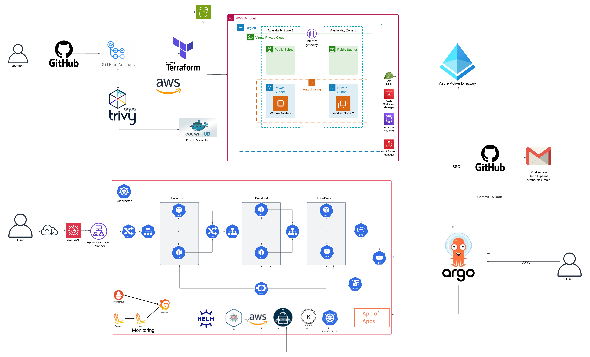

# project shop-online
# AWS Kubernetes Infrastructure Project

## Overview
This project implements a production-grade Kubernetes infrastructure on AWS, featuring comprehensive CI/CD pipelines, robust security measures, and modern DevOps practices. The infrastructure is fully automated using Terraform and follows GitOps principles with Argo CD.

## Architecture


### Key Components

#### Infrastructure Layer
- **AWS Cloud Infrastructure**
  - Virtual Private Cloud (VPC) with public and private subnets
  - EKS clusters for container orchestration
  - S3 buckets for storage and artifacts
  - Route 53 for DNS management
  - AWS Certificate Manager for SSL/TLS
  - AWS WAF for security and traffic control

#### Application Layer
- **Container Orchestration**
  - Kubernetes (EKS) for container management
  - Helm charts for package management
  - Argo CD for GitOps deployment
  - External Secrets for secure configuration
  - AWS Load Balancer Controller

#### Security Layer
- **Identity and Access Management**
  - Azure Active Directory SSO integration
  - IAM roles and policies
  - External Secrets with ClusterSecretStore
  - AWS Secrets Manager integration

#### Monitoring Stack
- **Observability Tools**
  - Prometheus for metrics collection
  - Grafana for visualization
  - Loki for log aggregation
  - Promtail for log collection

## Features

### CI/CD Pipeline
- GitHub Actions automation for:
  - Terraform deployments
  - Docker image builds (frontend and backend)
  - Security scanning with Aqua Trivy
  - Automated testing and deployment

### Kubernetes Management
- App of Apps pattern with Argo CD
- Helm charts for all components
- AWS Load Balancer Controller integration
- External DNS configuration
- ClusterSecretStore implementation

### Security Features
- AWS WAF protection
- SSL/TLS certification through ACM
- Secure secret management
- Azure AD SSO integration
- IAM role-based access control

### Monitoring and Logging
- Real-time metrics with Prometheus
- Visual dashboards in Grafana
- Centralized logging with Loki
- Log forwarding with Promtail

## Prerequisites
- AWS Account with administrative access
- Azure Active Directory tenant
- GitHub account with repository access
- kubectl and helm installed locally
- AWS CLI configured
- Terraform installed locally

## Getting Started

### Infrastructure Deployment
1. Clone the repository:
   ```bash
   git clone https://github.com/yourusername/project-name.git
   cd project-name
   ```

2. Initialize Terraform:
   ```bash
   cd terraform
   terraform init
   ```

3. Deploy the infrastructure:
   ```bash
   terraform plan
   terraform apply
   ```

### Argo CD Setup
1. Install Argo CD:
   ```bash
   kubectl create namespace argocd
   kubectl apply -n argocd -f https://raw.githubusercontent.com/argoproj/argo-cd/stable/manifests/install.yaml
   ```

2. Configure Azure AD SSO:
   ```bash
   kubectl apply -f azure-sso-config.yaml
   ```

### Application Deployment
1. Apply the App of Apps pattern:
   ```bash
   kubectl apply -f apps/root-app.yaml
   ```

2. Verify deployments:
   ```bash
   kubectl get applications -n argocd
   ```

## Security Configuration

### External Secrets
1. Configure AWS Secrets Manager:
   ```bash
   kubectl apply -f external-secrets/cluster-secret-store.yaml
   ```

2. Create secret definitions:
   ```bash
   kubectl apply -f external-secrets/secrets/
   ```

### SSL/TLS Setup
1. Request certificates in ACM
2. Configure DNS in Route 53
3. Update Load Balancer configuration

## Monitoring Setup

### Prometheus & Grafana
1. Deploy monitoring stack:
   ```bash
   helm upgrade --install monitoring ./helm/monitoring
   ```

2. Access Grafana:
   ```bash
   kubectl port-forward svc/grafana 3000:3000
   ```

### Logging Configuration
1. Deploy Loki and Promtail:
   ```bash
   helm upgrade --install logging ./helm/logging
   ```

2. Verify log collection:
   ```bash
   kubectl logs -n logging deployment/loki
   ```

## Maintenance

### Backup and Disaster Recovery
- Regular state file backups
- Cluster snapshot schedule
- Application backup procedures

### Updates and Upgrades
- Kubernetes version management
- Certificate rotation
- Security patch application

## Contributing
Please read [CONTRIBUTING.md](CONTRIBUTING.md) for details on our code of conduct and the process for submitting pull requests.

## License
This project is licensed under the MIT License - see the [LICENSE.md](LICENSE.md) file for details.

## Support
For support and queries, please create an issue in the GitHub repository or contact the infrastructure team.

## Authors
- Your Name
- Infrastructure Team

## Acknowledgments
- AWS EKS Team
- Argo CD Community
- Kubernetes Community